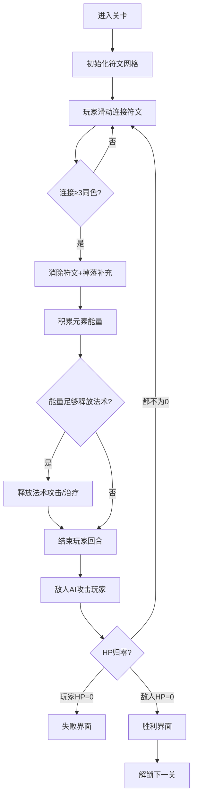

## 1. 产品概述

符文战棋是一款三消+战棋融合的策略游戏，玩家通过连接消除彩色符文积累元素能量，释放法术攻击敌人，在回合制战斗中击败对手。游戏融合了三消的爽快感和战棋的策略性，适合休闲与核心玩家。

- 核心玩法：滑动连接同色符文→积累元素能量→释放法术攻击→回合制战斗
- 目标价值：创造创新的策略游戏体验，提供多关卡挑战和进度留存

## 2. 核心 Features

### 2.1 功能模块列表

| 模块 | 核心功能 |
|------|----------|
| 符文网格 | 6x6彩色符文渲染、滑动连接、消除判定、掉落补充、连消判定 |
| 能量系统 | 四元素能量池（火/水/草/雷）、能量积累、能量不足禁用法术 |
| 战斗系统 | 敌方单位（生命值/元素抗性）、法术伤害/治疗、敌人AI攻击、胜负判定 |
| 回合机制 | 消除消耗回合、敌人行动预告、回合计数显示 |
| 关卡系统 | JSON配置多关卡、通关解锁、胜利界面（重试/下一关/返回菜单） |
| 数据留存 | localStorage保存进度、关卡解锁、最高通关记录 |
| UI交互 | 玩家血量、能量条、法术按钮、敌人血条、消除特效、伤害飘字、连接高亮 |

### 2.2 页面详情

| 页面名称 | 模块名称 | 功能描述 |
|----------|----------|----------|
| 主菜单 | 关卡选择 | 显示已解锁关卡、最高通关记录、开始游戏 |
| 战斗页面 | 符文网格区 | 6x6符文网格，Canvas绘制连接路径 |
| 战斗页面 | 玩家状态区 | 血量条、四元素能量池、法术按钮组 |
| 战斗页面 | 敌人状态区 | 敌人立绘、血量条、元素抗性、攻击预告 |
| 战斗页面 | 回合信息区 | 回合计数、敌人行动预告 |
| 胜利/失败弹窗 | 结算界面 | 显示战斗结果、重试/下一关/返回菜单按钮 |

## 3. 核心流程

### 3.1 战斗主流程

玩家进入关卡 → 初始化6x6符文网格 → 玩家滑动连接同色符文（≥3个）→ 消除符文并补充掉落 → 积累对应元素能量 → 消耗能量释放法术 → 对敌人造成伤害/治疗自己 → 结束回合 → 敌人攻击玩家 → 循环直到一方HP归零 → 结算界面

### 3.2 流程图

## 4. 用户界面设计

### 4.1 设计风格

- **主色调**：深邃紫 (#1a0b2e) 为背景，四元素主题色（火#ff4d4d、水#4da6ff、草#4dff88、雷#ffcc00）
- **副色调**：暗金 (#d4af37) 用于边框和高亮，深灰 (#2d2d44) 用于卡片背景
- **按钮风格**：圆角矩形，带渐变和发光效果，悬停时有缩放动画
- **字体**：标题使用 Cinzel（古典风格），正文使用 Noto Sans SC
- **布局风格**：左右分栏（左侧敌人信息+右侧玩家信息），中部为6x6符文网格
- **视觉元素**：符文发光效果、消除粒子特效、伤害数字飘字、能量流动动画

### 4.2 页面设计

| 页面 | 模块 | UI细节 |
|------|------|--------|
| 主菜单 | 关卡列表 | 卡片式布局，锁定关卡显示灰色遮罩，已通关显示星级 |
| 战斗页面 | 符文网格 | 6x6正方形格子，每个符文有发光效果，选中时高亮 |
| 战斗页面 | 能量池 | 四个圆形进度条，分别显示四元素能量值，不足时变灰 |
| 战斗页面 | 法术按钮 | 四个法术按钮，显示消耗能量和效果，能量不足时禁用 |
| 战斗页面 | 敌人区域 | 敌人立绘居中，血条在顶部，攻击预告显示即将造成的伤害 |

### 4.3 响应式

- 桌面端：左右分栏布局，符文网格居中
- 移动端：上下堆叠布局，符文网格自适应屏幕宽度
- 触摸优化：支持手指滑动连接符文，点击区域放大

### 4.4 动画与特效

- 符文消除：缩放消失+粒子爆炸效果
- 能量获取：数字飘字+能量条填充动画
- 法术释放：全屏元素特效+伤害数字飘字
- 敌人攻击：屏幕震动+伤害飘字
- 连接路径：Canvas绘制发光路径，随鼠标/手指移动
