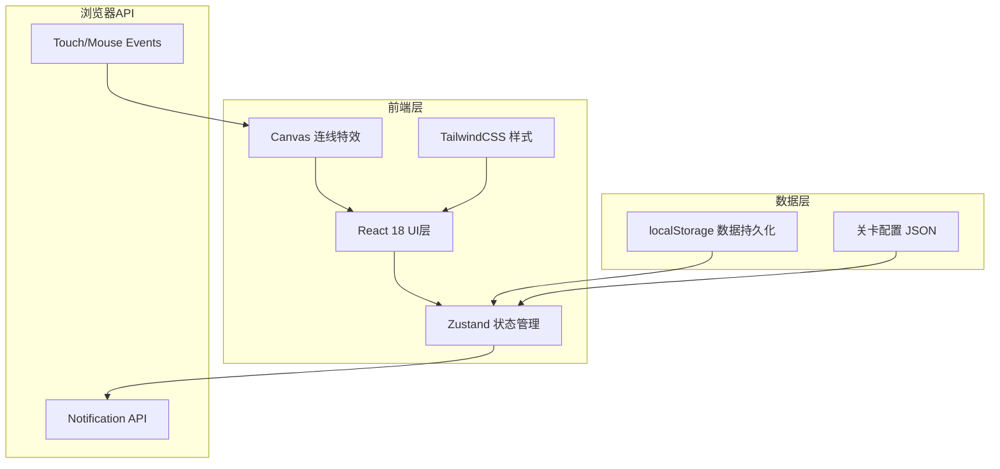

## 1. 架构设计



## 2. 技术栈说明

| 技术 | 版本 | 用途 |
|------|------|------|
| React | 18.x | UI框架 |
| TypeScript | 5.x | 类型安全 |
| Vite | 5.x | 构建工具 |
| TailwindCSS | 3.x | CSS框架 |
| React Router | 6.x | 路由管理 |
| Zustand | 4.x | 状态管理 |
| Canvas API | - | 绘制符文连接路径 |
| localStorage | - | 本地数据存储 |
| Notification API | - | 通关提醒 |
| lucide-react | latest | 图标库 |

## 3. 项目目录结构

```
src/
├── components/          # 组件目录
│   ├── RuneGrid.tsx     # 符文网格组件
│   ├── ConnectionCanvas.tsx  # 连线Canvas组件
│   ├── EnergyPool.tsx   # 能量池组件
│   ├── SpellButtons.tsx # 法术按钮组件
│   ├── EnemyCard.tsx    # 敌人卡片组件
│   ├── PlayerStatus.tsx # 玩家状态组件
│   ├── TurnInfo.tsx     # 回合信息组件
│   ├── BattleResult.tsx # 战斗结果弹窗
│   └── LevelCard.tsx    # 关卡卡片组件
├── pages/               # 页面目录
│   ├── MenuPage.tsx     # 主菜单页面
│   └── BattlePage.tsx   # 战斗页面
├── store/               # 状态管理
│   └── useGameStore.ts  # Zustand游戏状态
├── types/               # 类型定义
│   └── index.ts         # 核心类型
├── utils/               # 工具函数
│   ├── gameLogic.ts     # 游戏逻辑（消除、战斗计算）
│   ├── localStorage.ts  # 本地存储操作
│   └── notifications.ts # 通知API封装
├── data/                # 数据配置
│   └── levels.json      # 关卡配置
├── hooks/               # 自定义Hooks
│   ├── useRuneConnection.ts  # 符文连接逻辑
│   └── useBattleFlow.ts # 战斗流程控制
├── App.tsx              # 应用入口
├── main.tsx             # 渲染入口
└── index.css            # 全局样式
```

## 4. 路由定义

| 路由 | 页面 | 说明 |
|------|------|------|
| `/` | MenuPage | 主菜单，关卡选择 |
| `/battle/:levelId` | BattlePage | 战斗页面 |

## 5. 数据模型

### 5.1 核心类型定义

```typescript
// 元素类型
type ElementType = 'fire' | 'water' | 'grass' | 'thunder';

// 符文接口
interface Rune {
  id: string;
  element: ElementType;
  row: number;
  col: number;
  isSelected: boolean;
  isMatched: boolean;
}

// 能量池
interface EnergyPool {
  fire: number;
  water: number;
  grass: number;
  thunder: number;
}

// 法术接口
interface Spell {
  id: string;
  name: string;
  element: ElementType;
  cost: number;
  damage: number;
  heal: number;
  description: string;
}

// 敌人接口
interface Enemy {
  id: string;
  name: string;
  maxHp: number;
  currentHp: number;
  attack: number;
  resistance: Partial<Record<ElementType, number>>;
  attackPattern: number[];
  currentAttackIndex: number;
  sprite: string;
}

// 关卡接口
interface Level {
  id: number;
  name: string;
  description: string;
  enemy: Omit<Enemy, 'currentHp' | 'currentAttackIndex'>;
  playerMaxHp: number;
  maxEnergy: number;
  stars: number[];
}

// 游戏状态
interface GameState {
  currentLevelId: number | null;
  playerHp: number;
  playerMaxHp: number;
  energy: EnergyPool;
  maxEnergy: number;
  runeGrid: Rune[][];
  selectedRunes: Rune[];
  enemy: Enemy | null;
  turn: number;
  isPlayerTurn: boolean;
  battleStatus: 'idle' | 'playing' | 'victory' | 'defeat';
  unlockedLevels: number[];
  highestLevel: number;
  comboCount: number;
  floatingTexts: FloatingText[];
}

// 飘字特效
interface FloatingText {
  id: string;
  text: string;
  x: number;
  y: number;
  color: string;
  createdAt: number;
}
```

### 5.2 本地存储结构

```typescript
interface SaveData {
  unlockedLevels: number[];
  highestLevel: number;
  currentBattle: {
    levelId: number;
    playerHp: number;
    playerMaxHp: number;
    energy: EnergyPool;
    enemy: Enemy;
    turn: number;
  } | null;
}
```

## 6. 核心算法说明

### 6.1 符文连接判定

1. 鼠标/触摸按下时记录起始符文
2. 移动时检查是否相邻（8方向）且同色
3. 已选中的符文不能重复选择
4. 松开时检查长度≥3则消除

### 6.2 消除与掉落

1. 标记匹配的符文
2. 播放消除动画
3. 每列从上往下处理空位，上方符文下落
4. 顶部生成新符文填充

### 6.3 连消判定

1. 新符文生成后检查是否有新的匹配
2. 如有则继续消除，combo计数+1
3. 能量获取随combo倍数增加

### 6.4 伤害计算

```
最终伤害 = 法术基础伤害 × (1 - 敌人对应元素抗性) × 元素克制加成
元素克制：火克草，草克水，水克火，雷克水
```
